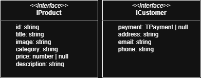
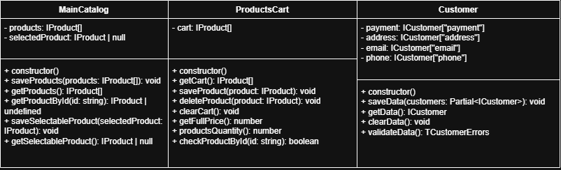
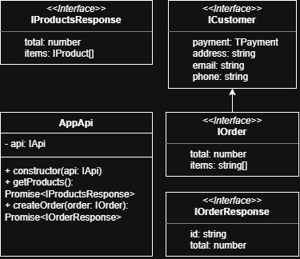
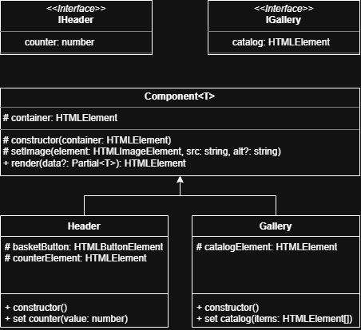
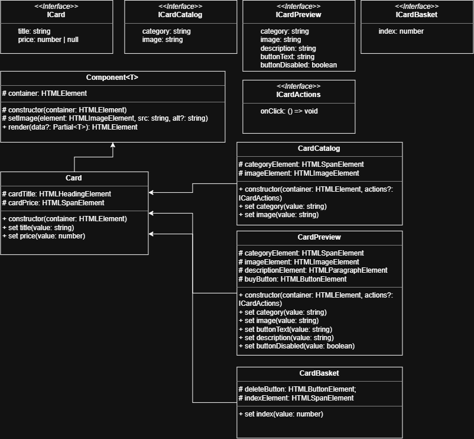

# Проектная работа "Веб-ларек"

Стек: HTML, SCSS, TS, Vite

Структура проекта:
- src/ — исходные файлы проекта
- src/components/ — папка с JS компонентами
- src/components/base/ — папка с базовым кодом

Важные файлы:
- index.html — HTML-файл главной страницы
- src/types/index.ts — файл с типами
- src/main.ts — точка входа приложения
- src/scss/styles.scss — корневой файл стилей
- src/utils/constants.ts — файл с константами
- src/utils/utils.ts — файл с утилитами

## Установка и запуск
Для установки и запуска проекта необходимо выполнить команды

```
npm install
npm run dev
```

или

```
yarn
yarn dev
```
## Сборка

```
npm run build
```

или

```
yarn build
```
# Интернет-магазин «Web-Larёk»
«Web-Larёk» — это интернет-магазин с товарами для веб-разработчиков, где пользователи могут просматривать товары, добавлять их в корзину и оформлять заказы. Сайт предоставляет удобный интерфейс с модальными окнами для просмотра деталей товаров, управления корзиной и выбора способа оплаты, обеспечивая полный цикл покупки с отправкой заказов на сервер.

## Архитектура приложения

Код приложения разделен на слои согласно парадигме MVP (Model-View-Presenter), которая обеспечивает четкое разделение ответственности между классами слоев Model и View. Каждый слой несет свой смысл и ответственность:

Model - слой данных, отвечает за хранение и изменение данных.  
View - слой представления, отвечает за отображение данных на странице.  
Presenter - презентер содержит основную логику приложения и  отвечает за связь представления и данных.

Взаимодействие между классами обеспечивается использованием событийно-ориентированного подхода. Модели и Представления генерируют события при изменении данных или взаимодействии пользователя с приложением, а Презентер обрабатывает эти события используя методы как Моделей, так и Представлений.

### Базовый код

#### Класс Component
Является базовым классом для всех компонентов интерфейса.
Класс является дженериком и принимает в переменной `T` тип данных, которые могут быть переданы в метод `render` для отображения.

Конструктор:  
`constructor(container: HTMLElement)` - принимает ссылку на DOM элемент за отображение, которого он отвечает.

Поля класса:  
`container: HTMLElement` - поле для хранения корневого DOM элемента компонента.

Методы класса:  
`render(data?: Partial<T>): HTMLElement` - Главный метод класса. Он принимает данные, которые необходимо отобразить в интерфейсе, записывает эти данные в поля класса и возвращает ссылку на DOM-элемент. Предполагается, что в классах, которые будут наследоваться от `Component` будут реализованы сеттеры для полей с данными, которые будут вызываться в момент вызова `render` и записывать данные в необходимые DOM элементы.  
`setImage(element: HTMLImageElement, src: string, alt?: string): void` - утилитарный метод для модификации DOM-элементов ``


#### Класс Api
Содержит в себе базовую логику отправки запросов.

Конструктор:  
`constructor(baseUrl: string, options: RequestInit = {})` - В конструктор передается базовый адрес сервера и опциональный объект с заголовками запросов.

Поля класса:  
`baseUrl: string` - базовый адрес сервера  
`options: RequestInit` - объект с заголовками, которые будут использованы для запросов.

Методы:  
`get(uri: string): Promise<object>` - выполняет GET запрос на переданный в параметрах ендпоинт и возвращает промис с объектом, которым ответил сервер  
`post(uri: string, data: object, method: ApiPostMethods = 'POST'): Promise<object>` - принимает объект с данными, которые будут переданы в JSON в теле запроса, и отправляет эти данные на ендпоинт переданный как параметр при вызове метода. По умолчанию выполняется `POST` запрос, но метод запроса может быть переопределен заданием третьего параметра при вызове.  
`handleResponse(response: Response): Promise<object>` - защищенный метод проверяющий ответ сервера на корректность и возвращающий объект с данными полученный от сервера или отклоненный промис, в случае некорректных данных.

#### Класс EventEmitter
Брокер событий реализует паттерн "Наблюдатель", позволяющий отправлять события и подписываться на события, происходящие в системе. Класс используется для связи слоя данных и представления.

Конструктор класса не принимает параметров.

Поля класса:  
`_events: Map<string | RegExp, Set<Function>>)` -  хранит коллекцию подписок на события. Ключи коллекции - названия событий или регулярное выражение, значения - коллекция функций обработчиков, которые будут вызваны при срабатывании события.

Методы класса:  
`on<T extends object>(event: EventName, callback: (data: T) => void): void` - подписка на событие, принимает название события и функцию обработчик.  
`emit<T extends object>(event: string, data?: T): void` - инициализация события. При вызове события в метод передается название события и объект с данными, который будет использован как аргумент для вызова обработчика.  
`trigger<T extends object>(event: string, context?: Partial<T>): (data: T) => void` - возвращает функцию, при вызове которой инициализируется требуемое в параметрах событие с передачей в него данных из второго параметра.

Данные
-
<div align="left">
  
</div>

В приложении используются две сущности, которые описывают данные — товар и покупатель. Их можно описать такими интерфейсами:
- Товар `IProduct` - предназначен для описания данных о товарах, имеющихся на сайте;
- Покупатель `ICustomer` - предназначен для описания данных о покупателях.
  - Интерфейс в качестве типа для поля `payment` использует тип `TPayment`: `export type TPayment = 'card' | 'cash';`. Данный тип описывает возможные виды оплаты.


Модели данных
-

<div align="center">
  
</div>

Для учёта данных в приложении используются классы, которые разделены между собой по смыслу и зонам ответственности:
-   хранение товаров, которые можно купить в приложении;
-   хранение товаров, которые пользователь выбрал для покупки;
-   данные покупателя, которые тот должен указать при оформлении заказа.

Взаимодействие с данными происходит на уровне методов (т.е. непосредственный доступ к хранимым данным есть внутри класса, а внешнее взаимодействие происходит через методы).

При использовании методов для получения данных, дальнейшая внешняя работа ведется с копией хранимых данных для защиты внутренних данных от несанкционированного изменения извне.

**Классы**
- `MainCatalog` - *Каталог товаров*
	-   `products: IProduct[]` - хранит массив всех товаров;
	-   `selectedProduct: IProduct | null` - хранит товар, выбранный для подробного отображения (в случае временного отсутствия такого товара хранит `null`);
	-   Пустой конструктор `constructor()` - создает пустой экземпляр класса `MainCatalog`;
	- методы:
	    -   `saveProducts()` - сохранение массива товаров полученного в параметрах метода. Получает на вход массив данных `IProduct[]`;
	    -   `getProducts()` - получение массива товаров из модели. Возвращает копию массива товаров `IProduct[]`;
	    -   `getProductById()` - получение одного товара по его id. Получает на вход `id` товара в виде строки (`string`), возвращает найденный товар, либо `undefined` в случае отсутствия товара (`IProduct | undefined`);
	    -   `saveSelectedProduct()` - сохранение товара для подробного отображения. Получает на вход сам товар `selectedProduct: IProduct`;
	    -   `getSelectedProduct()` - получение товара для подробного отображения. Возвращает товар для отображения либо `null` в случае отсутствия такого товара (`IProduct | null`);
 - `ProductsCart` - *Корзина*
	-   `cart: IProduct[]` - хранит массив товаров, выбранных покупателем для покупки.
	-   Пустой конструктор `constructor()` - создает пустой экземпляр класса `ProductsCart`;
	-   методы:
	    -   `getCart()` - получение массива товаров, которые находятся в корзине. Возвращает копию массива данных `IProduct[]`;
	    -   `saveProduct()` - добавление товара, который был получен в параметре, в массив корзины. Получает на вход сам товар `product: IProduct`, ничего не возвращает (`void`);
	    -   `deleteProduct()` - удаление товара, полученного в параметре из массива корзины. Получает на вход сам товар `product: IProduct`;
	    -   `clearCart()` - очистка корзины. Ничего не возвращает (`void`);
	    -   `getFullPrice()` - получение стоимости всех товаров в корзине. Возвращает число `number` - стоимость всех товаров;
	    -   `productsQuantity()` - получение количества товаров в корзине. Возвращает число `number` - количество товаров;
	    -   `checkProductById()` - проверка наличия товара в корзине по его id, полученного в параметр метода. Получает на вход сам `id` типа `string` и возвращает булево значение `boolean`, говорящее о том, есть ли товар в наличии.
  - `Customer` - *Покупатель*
  	- хранит следующие данные:
	    -   `payment: ICustomer["payment"]` - вид оплаты;
	    -   `address: ICustomer["address"]` - адреc;
	    -   `phone ICustomer["phone"]` - телефон;
	    -   `email ICustomer["email"]` - email.
    - Пустой конструктор `constructor()` - создает пустой экземпляр класса `Customer`;
    - методы:
	    -   `saveData()` - сохранение данных в модели. Получает на вход опциональные данные для сохранения `Partial<ICustomer>`, ничего не возвращает (`void`);
	    -   `getData()` - получение данных покупателя. Возвращает копию данных покупателя в виде `ICustomer`;
	    -   `clearData()` - очистка данных покупателя, ничего не возвращает (`void`).
	    -   `validateData()` - валидация данных. Возвращает объект типа `TCustomerErrors`, содержащий ошибки для каждого поля.
             - Используемый тип: `export type TCustomerErrors = Partial<Record<keyof ICustomer, string>>;`

Слой коммуникации
-
<div align="center">
  
</div>

- Для взаимодействия приложения с сервером используется класс `AppApi`, который использует композицию: внутри себя содержит объект, реализующий интерфейс `IApi` (экземпляр класса `Api`), через который выполняются HTTP-запросы. Так же дополнительно используются интерфейсы для работы с получением товаров и созданием заказа.
  - *Конструктор* `constructor(api: IApi)` - принимает экземпляр класса для отправки запросов (`Api`).
  - *Методы:*
    - `getProducts(): Promise<IProductsResponse>` — выполняет `GET`-запрос на эндпоинт `/product/`. Возвращает объект с общим количеством товаров (`total`) и массивом объектов товаров (`items`).
    - `createOrder(order: IOrder): Promise<IOrderResponse>` — выполняет `POST`-запрос на эндпоинт `/order/`, передавая данные о заказе (способы оплаты, контакты, итоговая сумма и список ID товаров). Возвращает объект с ID выполненного заказа и итоговой списанной суммой.

  - *Интерфейсы и типы*:

  ```typescript
  	export interface IProductsResponse {
  			total: number;
  			items: IProduct[];
  	}

  	export interface IOrder extends ICustomer{
  			total: number;
  			items: string[];
  	}

  	export interface IOrderResponse { 
  			id: string;
  			total: number;
  	}
	```

Слой представления
-
<div align="center">
  
</div>

###  **1. Класс `Header`**

Класс отвечает за управление шапкой сайта: отображение счетчика товаров в корзине и обработку клика по кнопке корзины.

**Управляет интерфейсом:** `IHeader`
-   `counter` (number) — передаваемое числовое значение счетчика товаров в корзине.

**Наследуется от:** `Component<IHeader>`

### Свойства

-   `counterElement: HTMLElement` — элемент разметки счетчика.

-   `basketButton: HTMLButtonElement` — элемент разметки кнопки открытия корзины.

### Конструктор

```ts
constructor(protected  events: IEvents, container: HTMLElement)
```

-   **Принимает:**
    
      
    -   `events`: Экземпляр брокера событий (`IEvents`) для генерации внешних событий.    
        
    -   `container`: Главный контейнер шапки в разметке.
 
-   **Поведение:** Вызывает конструктор базового класса `Component`, находит нужные элементы внутри `container` и вешает слушатель события `'click'` на кнопку корзины, который генерирует событие `'basket:open'`.

### Сеттеры

-   **`set counter(value: number)`**
    
      -  Устанавливает новое текстовое значение в элемент счетчика `counterElement`.
    
      
    

### **2. Класс `Gallery`**

Класс отвечает за отображение каталога карточек/товаров в виде галереи.

**Управляет интерфейсом:** `IGallery`

-   `catalog` (HTMLElement[]) — массив элементов карточек для отображения.

**Наследуется от:** `Component<IGallery>`

### Свойства

-   `catalogElement: HTMLElement` — элемент контейнера галереи.
 
### Конструктор

```ts
constructor(container: HTMLElement)

```

-   **Принимает:**
    -   `container`: Главный контейнер (или сам элемент галереи).

-   **Поведение:** Вызывает конструктор базового класса `Component`, находит элемент галереи внутри переданного контейнера.
    
      
    

### Сеттеры

-   **`set catalog(items: HTMLElement[])`**
    -   Принимает массив элементов `items` и добавляет их в элемент `catalogElement` с помощью метода `.replaceChildren()`.


<div align="center">
  
</div>

**Интерфейсы**
-   **ICard** — базовый интерфейс данных карточки.
    -   `title: string` — заголовок/название товара.
        
          
        
    -   `price: number | null` — цена товара (`null` используется для бесценных товаров).
        
          
        
-   **ICardCatalog** — расширение данных для карточки в каталоге.
    
      
    -   `category: string` — категория товара.
        
          
        
    -   `image: string` — изображение товара.
        
          
        
-   **ICardPreview** — расширение данных для карточки предпросмотра (в модальном окне).
    
      
    -   `category: string` — категория товара.
        
          
        
    -   `image: string` — изображение товара.
        
          
        
    -   `description: string` — описание товара.
        
          
        
    -   `buttonText: string` — текст на кнопке действия (например, «В корзину»).
        
          
        
    -   `buttonDisabled: boolean` — флаг блокировки кнопки.
        
          
        
-   **ICardBasket** — расширение данных для карточки в корзине.
    
      
    -   `index: number` — порядковый номер товара в списке.
        
          
        
-   **ICardActions** — интерфейс для передачи пользовательских событий.
    
      
    -   `onClick: () => void` — функция обратного вызова при клике на элемент, исполняющаяся при срабатывании события.
        
          
        

**Классы**

  

**Card<T>**

Базовый класс карточки, наследующий `Component<ICard & T>`.

  

-   **Поля:** `cardTitle` (заголовок), `cardPrice` (цена).
    
      
    
-   **Конструктор:** `constructor(container: HTMLElement)` — находит элементы заголовка и цены.
    
      
    
-   **Сеттеры:**
    
      
    -   `title(value: string)` — устанавливает текст заголовка.
        
          
        
    -   `price(value: number)` — выводит цену в синапсах или текст «Бесценно» при отсутствии значения.
        
          
        

**CardCatalog**

Класс для карточек в главном каталоге. Наследует `Card<ICardCatalog>`.

  

-   **Поля:** `categoryElement` (элемент категории), `imageElement` (картинка).
    
      
    
-   **Конструктор:** `constructor(container: HTMLElement, actions?: ICardActions)` — находит элементы и вешает событие `onClick` на всю карточку.
    
      
    
-   **Сеттеры:**
    
      
    -   `category(value: string)` — задает текст категории и переключает CSS-классы по `categoryMap`.
        
          
        
    -   `image(value: string)` — подгружает изображение товара.
        
          
        

**CardPreview**

Класс для детального просмотра карточки в модальном окне. Наследует `Card<ICardPreview>`.

  

-   **Поля:** `categoryElement`, `imageElement`, `descriptionElement` (описание), `buyButton` (кнопка действия).
    
      
    
-   **Конструктор:** `constructor(container: HTMLElement, actions?: ICardActions)` — инициализирует элементы и связывает `onClick` с кнопкой действия.
    
      
    
-   **Сеттеры:**
    
      
    -   `category(value: string)` — задает категорию и её CSS-стиль.
        
          
        
    -   `image(value: string)` — устанавливает изображение.
        
          
        
    -   `description(value: string)` — устанавливает текст описания.
        
          
        
    -   `buttonText(value: string)` — меняет надпись на кнопке.
        
          
        
    -   `buttonDisabled(value: boolean)` — блокирует или разблокирует кнопку.
        
          
        

**CardBasket**

Класс для компактной карточки товара в корзине. Наследует `Card<ICardBasket>`.

  

-   **Поля:** `indexElement` (номер в списке), `deleteButton` (кнопка удаления).
    
      
    
-   **Конструктор:** `constructor(container: HTMLElement, actions?: ICardActions)` — инициализирует элементы и навешивает `onClick` на кнопку удаления.
    
      
    
-   **Сеттеры:**
    
      
    -   `index(value: number)` — задает порядковый номер позиций.